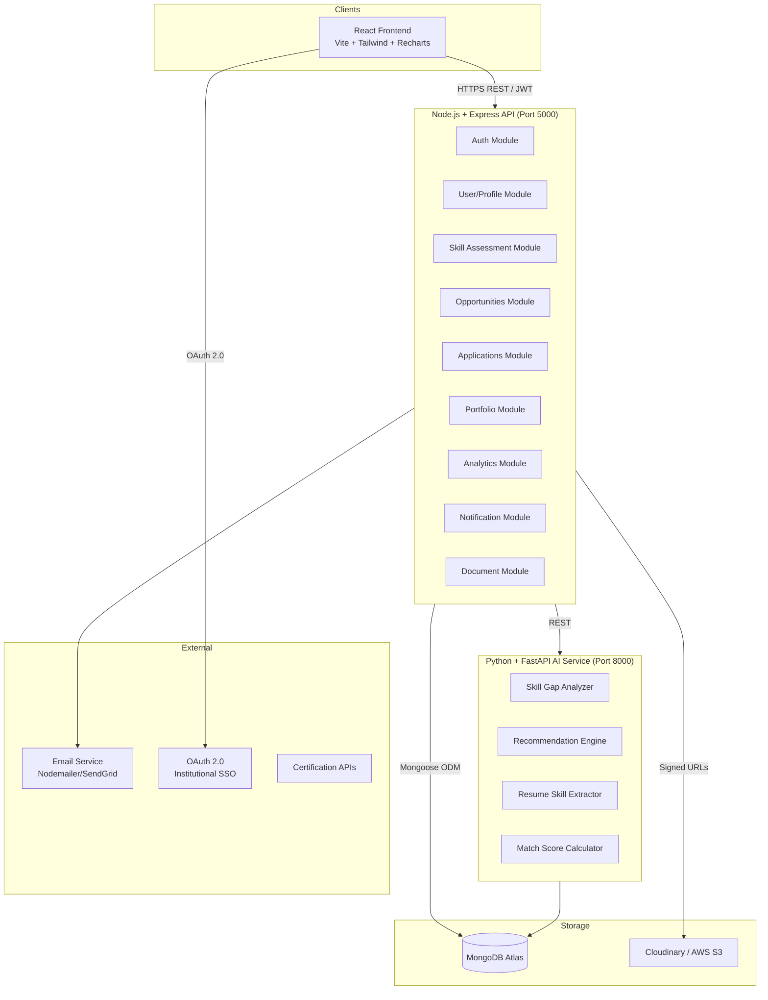

# Design Document: Academia–Industry Collaboration Portal

## Overview

The Academia–Industry Collaboration Portal is a full-stack web platform built on the **MERN stack** (MongoDB, Express.js, React.js, Node.js) with a separate **Python + FastAPI AI/ML microservice**. It implements a complete closed-loop employability ecosystem:

> Assessment → Skill Profile → Skill Gap Analysis → Learning Recommendation → Internship/Job Matching → Application → Evaluation → Placement → Digital Portfolio

The system supports five roles (Student, Academician, Industry_Partner, Institution_Admin, Platform_Admin), enforces role-based access control via JWT, and delegates all AI-intensive operations (skill gap analysis, recommendation, resume parsing) to a decoupled Python service.

---

## Architecture

### High-Level Architecture



### Key Architectural Decisions

| Decision | Choice | Rationale |
|---|---|---|
| Primary Backend | Node.js + Express | Strong ecosystem for CRUD, auth, file handling, dashboards |
| AI/ML Service | Python + FastAPI | Superior ML ecosystem; decoupled so it can scale independently |
| Database | MongoDB Atlas | Flexible documents for varied user types and skill schemas |
| File Storage | Cloudinary / S3 | Files stored externally; only URLs in MongoDB |
| Auth | JWT (stateless) | Scalable, role-encoded tokens |
| Frontend | React + Vite + Tailwind | Fast build, responsive UI, rich chart support |
| Recommendation | Rule-based + Weighted Matching (Phase 1), ML Ranking (Phase 2) | Demonstrable at hackathon, upgradeable |

---

## Components and Interfaces

### Backend Modules (Node.js + Express)

#### Auth Module
- `POST /api/auth/register` — register new user, send verification email
- `POST /api/auth/login` — authenticate, return JWT
- `POST /api/auth/logout` — invalidate token (blocklist)
- `GET /api/auth/me` — return current user profile
- `POST /api/auth/verify-email` — activate account from email token
- `POST /api/auth/forgot-password` — send reset link
- `POST /api/auth/reset-password` — set new password

#### Student Module
- `GET /api/students/profile` — fetch full student profile
- `PUT /api/students/profile` — update profile, career interests
- `GET /api/students/recommendations` — fetch personalized recommendations
- `GET /api/students/skill-gaps` — fetch current skill gaps
- `GET /api/students/applications` — fetch all applications
- `GET /api/students/portfolio` — fetch portfolio
- `POST /api/students/portfolio/projects` — add project
- `POST /api/students/certifications` — add certification

#### Assessment Module
- `GET /api/assessments` — list available assessments
- `GET /api/assessments/:id` — fetch assessment questions
- `POST /api/assessments/:id/submit` — submit answers, trigger AI skill analysis
- `GET /api/assessments/results/:studentId` — fetch assessment history

#### Opportunities Module
- `GET /api/opportunities` — search/filter opportunities
- `GET /api/opportunities/:id` — get opportunity detail
- `POST /api/opportunities` — create (Industry_Partner only)
- `PUT /api/opportunities/:id` — update (owner only)
- `DELETE /api/opportunities/:id` — withdraw (owner only)
- `GET /api/opportunities/recommended` — get personalized recommendations

#### Applications Module
- `POST /api/applications` — submit application
- `GET /api/applications/:id` — get application detail
- `PUT /api/applications/:id/status` — update status (Industry_Partner)
- `DELETE /api/applications/:id` — withdraw (Student)
- `GET /api/applications/analytics` — funnel metrics (Industry_Partner)

#### Portfolio Module
- `GET /api/portfolio/:username` — public portfolio (no auth)
- `PUT /api/portfolio/items/:itemId/verify` — verify item (admin/industry)

#### Analytics Module
- `GET /api/analytics/institution` — institution dashboard metrics
- `GET /api/analytics/industry` — industry recruitment metrics
- `GET /api/analytics/skill-demand` — aggregated skill demand

#### Document Module
- `POST /api/documents/upload` — upload file, return signed URL
- `DELETE /api/documents/:id` — delete document
- `GET /api/documents/audit-log` — audit log (admin)

### AI Service Endpoints (Python + FastAPI)

- `POST /ai/analyze-skills` — compute Skill_Profile and Skill_Gap from assessment answers
- `POST /ai/recommendations` — return ranked opportunity and program recommendations
- `POST /ai/extract-resume-skills` — parse resume, extract and normalize skill list
- `POST /ai/match-score` — compute Match_Score between student profile and opportunity

### Frontend Pages

```
Public:        /  /about  /login  /register  /jobs  /internships
Student:       /student/dashboard  /assessment  /skills  /skill-gaps
               /recommendations  /internships  /jobs  /applications  /portfolio  /learning
Industry:      /industry/dashboard  /profile  /jobs  /internships  /applications  /candidates  /programs
Academician:   /faculty/dashboard  /profile  /internships  /fdp  /research  /collaboration
Institution:   /institution/dashboard  /students  /analytics  /placements  /internships
Admin:         /admin/dashboard  /users  /verifications  /analytics
```

---

## Data Models

### User Document
```javascript
{
  _id: ObjectId,
  name: String,                // required
  email: String,               // unique, required
  passwordHash: String,        // bcrypt, never returned in responses
  role: Enum["student","academician","industry","institution","admin"],
  phone: String,
  profileImageUrl: String,
  organizationId: ObjectId,    // ref: Institution or Industry
  isEmailVerified: Boolean,
  isOrganizationVerified: Boolean,  // for industry accounts
  emailVerificationToken: String,
  passwordResetToken: String,
  passwordResetExpiry: Date,
  notificationPreferences: {
    applicationUpdates: Boolean,
    recommendations: Boolean,
    deadlineAlerts: Boolean,
    mentorFeedback: Boolean
  },
  lastLoginAt: Date,
  createdAt: Date,
  updatedAt: Date
}
```

### Student Profile Document
```javascript
{
  _id: ObjectId,
  userId: ObjectId,            // ref: User
  institution: String,
  department: String,
  branch: String,
  graduationYear: Number,
  cgpa: Number,
  careerInterests: [String],
  targetIndustries: [String],
  locationPreference: String,
  resumeUrl: String,
  skills: [{
    skillId: ObjectId,
    name: String,
    score: Number,             // 0-100
    verificationLevel: Enum["self_declared","assessment_verified","course_verified","industry_verified"],
    verifiedBy: ObjectId,
    verifiedAt: Date
  }],
  aptitudeScore: {
    logicalReasoning: Number,
    quantitative: Number,
    verbal: Number
  },
  placementReadinessScore: Number,   // computed
  isPlaced: Boolean,
  placedAt: Date,
  projects: [{
    title: String,
    description: String,
    techStack: [String],
    url: String,
    verificationLevel: String
  }],
  achievements: [String],
  createdAt: Date,
  updatedAt: Date
}
```

### Skill Document
```javascript
{
  _id: ObjectId,
  name: String,               // canonical name, e.g. "React"
  aliases: [String],          // ["React.js", "ReactJS", "react"]
  category: Enum["technical","soft_skill","aptitude","domain"],
  description: String,
  industryBenchmark: Number,  // industry-defined required score (0-100)
  relatedSkills: [ObjectId],
  industryDemandCount: Number, // aggregated from postings
  createdAt: Date,
  updatedAt: Date
}
```

### Assessment Document
```javascript
{
  _id: ObjectId,
  title: String,
  category: Enum["technical","soft_skill","aptitude","combined"],
  questions: [{
    questionId: ObjectId,
    text: String,
    options: [String],
    correctAnswer: Number,    // index
    skillId: ObjectId,
    difficulty: Enum["easy","medium","hard"],
    isAdaptive: Boolean
  }],
  durationMinutes: Number,
  isActive: Boolean,
  createdBy: ObjectId,        // Platform_Admin or Industry_Partner
  createdAt: Date
}
```

### Assessment Result Document
```javascript
{
  _id: ObjectId,
  studentId: ObjectId,
  assessmentId: ObjectId,
  totalScore: Number,
  skillScores: [{
    skillId: ObjectId,
    skillName: String,
    score: Number,            // 0-100
    gap: Number,              // Required - Student score
    gapPriority: Enum["ready","moderate","significant","major"]
  }],
  isActive: Boolean,          // most recent = true
  completedAt: Date
}
```

### Opportunity Document
```javascript
{
  _id: ObjectId,
  industryId: ObjectId,       // ref: User (industry)
  title: String,
  type: Enum["internship","apprenticeship","live_project","entry_level_job","research_collaboration","fdp","faculty_internship","consultancy"],
  targetAudience: Enum["student","academician","both"],
  description: String,
  requiredSkills: [{
    skillId: ObjectId,
    name: String,
    requiredScore: Number     // 0-100 minimum proficiency
  }],
  eligibilityCriteria: {
    minCgpa: Number,
    branches: [String],
    graduationYears: [Number]
  },
  duration: String,
  stipend: String,
  location: String,
  workMode: Enum["remote","onsite","hybrid"],
  numberOfPositions: Number,
  applicationDeadline: Date,
  status: Enum["draft","active","closed","withdrawn"],
  applicantCount: Number,
  createdAt: Date,
  updatedAt: Date
}
```

### Application Document
```javascript
{
  _id: ObjectId,
  applicantId: ObjectId,      // ref: User (student or academician)
  opportunityId: ObjectId,
  portfolioSnapshot: Object,  // snapshot at time of application
  matchScore: Number,         // computed at submission time
  status: Enum["applied","under_review","shortlisted","assessment","interview","selected","rejected","withdrawn"],
  statusHistory: [{
    status: String,
    changedAt: Date,
    changedBy: ObjectId,
    note: String
  }],
  appliedAt: Date,
  updatedAt: Date
}
```

### Portfolio Document
```javascript
{
  _id: ObjectId,
  studentId: ObjectId,
  publicSlug: String,         // e.g. "rahul-sharma-2024"
  isPublic: Boolean,
  showSelfDeclaredItems: Boolean,
  skills: [ObjectId],         // ref: Student.skills
  certifications: [{
    title: String,
    issuer: String,
    issueDate: Date,
    expiryDate: Date,
    credentialUrl: String,
    verificationLevel: String,
    documentUrl: String
  }],
  internshipRecords: [{
    opportunityId: ObjectId,
    companyName: String,
    role: String,
    startDate: Date,
    endDate: Date,
    mentorFeedback: String,
    completionCertificateUrl: String,
    isVerified: Boolean
  }],
  projects: [Object],
  achievements: [String],
  placementReadinessScore: Number,
  updatedAt: Date
}
```

### Notification Document
```javascript
{
  _id: ObjectId,
  recipientId: ObjectId,
  type: Enum["application_update","recommendation","deadline_alert","mentor_feedback","verification","system"],
  title: String,
  message: String,
  relatedEntityId: ObjectId,
  relatedEntityType: String,
  isRead: Boolean,
  emailSent: Boolean,
  emailAttempts: Number,
  createdAt: Date
}
```

### Audit Log Document
```javascript
{
  _id: ObjectId,
  userId: ObjectId,
  action: Enum["upload","access","delete","share","verify"],
  entityType: String,
  entityId: ObjectId,
  ipAddress: String,
  userAgent: String,
  timestamp: Date
}
```

---

## Skill Gap and Match Score Formulas

### Skill Gap Calculation
```
Skill_Gap(skill) = Required_Score(skill) - Student_Score(skill)

Gap Priority:
  0–10   → "ready"
  11–25  → "moderate"
  26–40  → "significant"
  41–100 → "major"
```

### Match Score Calculation (Opportunity ↔ Student)
```
Match_Score = 0.50 × Technical_Skill_Match
            + 0.15 × Soft_Skill_Match
            + 0.10 × Education_Match
            + 0.10 × Career_Interest_Match
            + 0.10 × Projects_Match
            + 0.05 × Location_Match

Where each component is 0–100.
```

### Placement Readiness Score
```
Placement_Readiness = 0.40 × Technical_Avg
                    + 0.15 × Soft_Avg
                    + 0.15 × Aptitude_Avg
                    + 0.10 × Projects_Count_Normalized
                    + 0.05 × Certifications_Count_Normalized
                    + 0.10 × Internship_Experience_Score
                    + 0.05 × Resume_Quality_Score
```

---

## Correctness Properties

*A property is a characteristic or behavior that should hold true across all valid executions of a system — essentially, a formal statement about what the system should do. Properties serve as the bridge between human-readable specifications and machine-verifiable correctness guarantees. Each property below is universally quantified and intended for property-based testing.*

---

### Property 1: Skill Gap Non-Negativity in Profile
*For any* student assessment result and any skill in that result, the computed gap priority classification SHALL correspond exactly to the computed numeric gap value according to the classification thresholds (0–10: ready, 11–25: moderate, 26–40: significant, 41+: major), and the gap value SHALL equal Required_Score minus Student_Score.
**Validates: Requirements 2.2, 2.9**

---

### Property 2: Match Score Bounded Range
*For any* student profile and any opportunity, the computed Match_Score SHALL be a value in the closed interval [0, 100].
**Validates: Requirements 3.3, 5.2**

---

### Property 3: Match Score Component Weight Integrity
*For any* student profile and opportunity, the Match_Score computed using the weighted formula SHALL equal the sum of each component multiplied by its defined weight (0.50 + 0.15 + 0.10 + 0.10 + 0.10 + 0.05 = 1.00), ensuring weights are normalized.
**Validates: Requirements 3.3**

---

### Property 4: Placement Readiness Score Bounded Range
*For any* student profile, the computed Placement_Readiness_Score SHALL be a value in the closed interval [0, 100].
**Validates: Requirements 9.7**

---

### Property 5: Skill Gap Drives Recommendation Ordering
*For any* student Skill_Profile with identified skill gaps, the Recommendation_Engine SHALL return learning programs targeting Major Gap skills before programs targeting Moderate Gap skills (i.e. recommendations are ordered by descending gap priority).
**Validates: Requirements 3.2, 6.6**

---

### Property 6: No Duplicate Applications
*For any* student and any opportunity, submitting an application when an active (non-Withdrawn) application already exists for that student-opportunity pair SHALL be rejected, and the application count for that opportunity SHALL remain unchanged.
**Validates: Requirements 5.7**

---

### Property 7: Application Status Monotonicity
*For any* application, the status history SHALL form a valid sequence where each transition follows the allowed state machine (Applied → Under_Review → Shortlisted → Assessment → Interview → Selected/Rejected, or any state → Withdrawn), and no backward transitions outside this machine SHALL be recorded.
**Validates: Requirements 5.4**

---

### Property 8: Skill Verification Level Monotonicity
*For any* skill entry in a student's portfolio, the Verification_Level SHALL only increase or remain the same over time (Self_Declared → Assessment_Verified → Course_Verified → Industry_Verified), and SHALL never decrease.
**Validates: Requirements 9.1, 9.2, 9.3**

---

### Property 9: Public Portfolio Filters Unverified Items
*For any* student portfolio accessed via the public URL when showSelfDeclaredItems is false, the returned portfolio SHALL contain only items with Verification_Level of assessment_verified, course_verified, or industry_verified — and no self_declared items.
**Validates: Requirements 9.4, 9.5**

---

### Property 10: Opportunity Auto-Close on Deadline
*For any* opportunity whose applicationDeadline has passed, the opportunity status SHALL be closed and new application submissions SHALL be rejected with an appropriate error.
**Validates: Requirements 4.3**

---

### Property 11: Resume Skill Normalization Idempotence
*For any* resume containing skill aliases (e.g. "ReactJS", "React.js", "react"), the skill extractor SHALL map all aliases to the same canonical skill name, and running the extractor twice on the same input SHALL produce the same canonical skill list.
**Validates: Requirements 14.3**

---

### Property 12: Placed Student Excluded from Recommendations
*For any* student whose isPlaced field is true, the Recommendation_Engine SHALL not include that student in placement opportunity recommendation results.
**Validates: Requirements 13.5**

---

### Property 13: Assessment Score Round Trip Consistency
*For any* assessment submission, storing the result and re-reading it from the database SHALL produce the same skillScores array and gapPriority classifications as the original computation, with no data loss or mutation.
**Validates: Requirements 2.4**

---

### Property 14: Password Storage Safety
*For any* user registration, the stored passwordHash in the database SHALL NOT equal the plaintext password provided during registration.
**Validates: Requirements 17.2**

---

### Property 15: Document Upload Type and Size Validation
*For any* file upload attempt with a file size exceeding 10 MB or a MIME type not in the permitted list (PDF, DOCX, JPG, PNG), THE Platform SHALL reject the upload and return a 400-level error — and the document count in storage SHALL remain unchanged.
**Validates: Requirements 12.1, 12.2**

---

## Error Handling

All API responses follow a consistent envelope:

```json
// Success
{ "success": true, "message": "...", "data": {} }

// Failure
{ "success": false, "message": "Human-readable error", "errors": [] }
```

### Error Categories

| Category | HTTP Status | Behavior |
|---|---|---|
| Validation error | 400 | Return field-level error list |
| Authentication error | 401 | Return generic auth error (no details) |
| Authorization error | 403 | Return role/resource error |
| Not found | 404 | Return entity-specific message |
| Conflict (duplicate) | 409 | e.g. duplicate application |
| Rate limit exceeded | 429 | Return retry-after header |
| AI service unavailable | 503 | Fallback to manual entry, log error |
| Internal server error | 500 | Log full error, return sanitized message |

### AI Service Failure Handling
- If the Python AI service is unreachable, the Node.js backend returns a 503 with a fallback message.
- Resume skill extraction failure → show manual skill entry form to student.
- Recommendation failure → show generic "refresh" prompt, log error for monitoring.

### External Integration Failure Handling
- Retry with exponential backoff: 1s, 2s, 4s (max 3 attempts).
- After 3 failures, alert Platform_Admin via notification and log with full context.
- Webhook delivery failures are retried independently and logged in audit log.

---

## Testing Strategy

### Technology Choices

| Layer | Tool |
|---|---|
| Node.js unit + integration tests | **Jest** + **Supertest** |
| Property-based tests (Node.js) | **fast-check** |
| Python AI service unit tests | **pytest** |
| Property-based tests (Python) | **Hypothesis** |
| API testing | **Postman / Newman** (CI) |
| Frontend tests | **Vitest** + **React Testing Library** |

### Dual Testing Approach

**Unit Tests** cover:
- Specific examples for edge cases (e.g. empty resume, 0-score assessment)
- Error condition branches (invalid MIME type, expired token)
- Integration points between modules (application triggers notification)

**Property-Based Tests** cover the 15 correctness properties listed above. Each property-based test:
- Runs a **minimum of 100 iterations** with random inputs generated by fast-check (Node.js) or Hypothesis (Python)
- Is tagged with the property it validates

### Property Test Tag Format
```
// Feature: academia-industry-portal, Property {N}: {property_title}
```

### Test Coverage Targets
- Core business logic (skill gap, match score, placement readiness): 90%+
- Auth and security middleware: 95%+
- API route handlers: 80%+
- AI service functions: 85%+

### Integration Test Scenarios
1. Student registers → takes assessment → receives recommendations → applies → gets status update → portfolio updated
2. Industry posts opportunity → student applies → industry shortlists → student placed → institution analytics updated
3. Academician applies for FDP → status updated → completion recorded → profile updated
